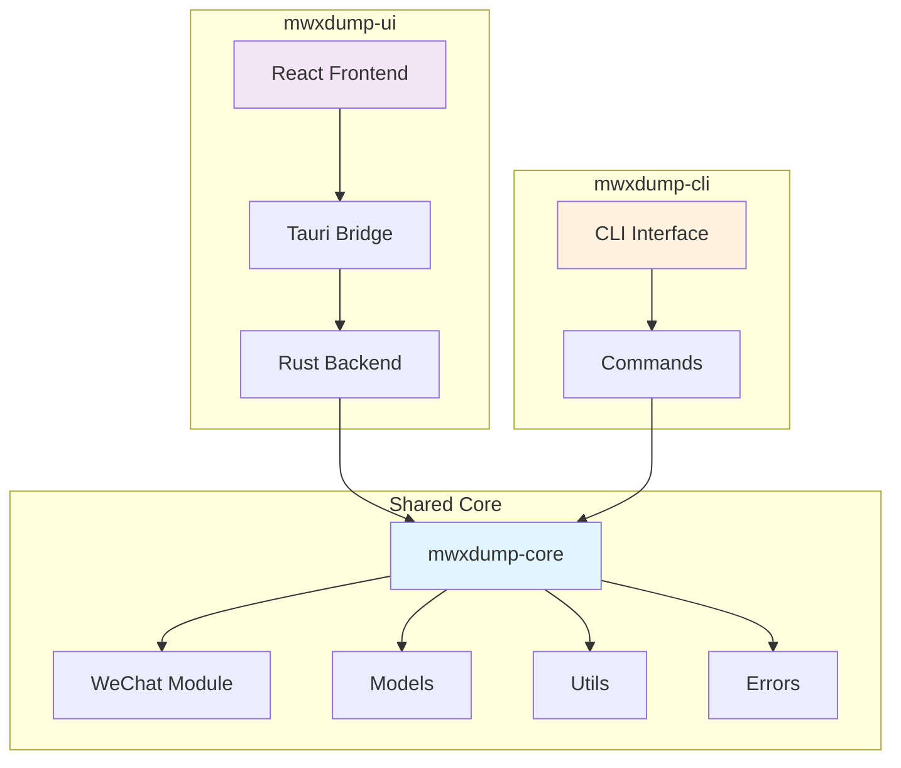

# MwXdump 项目整合分析报告

## 项目概述

本文档分析了MwXdump项目的当前状态。项目已成功完成整合重构，采用Workspace架构实现代码共享和模块化管理。

### 项目基本信息

| 项目 | 类型 | 技术栈 | 状态 |
|------|------|--------|------|
| mwxdump-core | Rust 共享库 | Rust + Tokio + 加密库 + 系统API | ✅ 已完成 |
| mwxdump-cli | Rust CLI应用 | Rust + Clap + Axum + Core库 | ✅ 已完成 |
| mwxdump-ui | Tauri桌面应用 | React + TypeScript + Tauri + Core库 | ✅ 已整合 |

## 项目详细分析

### 1. 整合后的项目架构

#### 1.1 Workspace 结构
项目采用 Cargo Workspace 管理多个 crate：

```toml
[workspace]
members = [
    "core",         # 共享核心库
    "cli",          # CLI 应用
    "ui/src-tauri"  # Tauri 后端
]
resolver = "2"
```

#### 1.2 共享依赖管理
通过 `[workspace.dependencies]` 统一管理依赖版本：

**核心依赖**:
- **异步运行时**: Tokio 1.46 (full features)
- **序列化**: Serde 1.0 + Serde-JSON
- **错误处理**: Thiserror 2.0.12 + Anyhow 1.0
- **日志**: Tracing 0.1
- **时间处理**: Chrono 0.4 + UUID 1.17

**功能模块**:
- **加密解密**: AES, CBC, HMAC, SHA1/SHA2, PBKDF2
- **压缩**: LZ4, Flate2
- **序列化**: Serde, Prost (Protocol Buffers)
- **数据库**: SQLx 0.8 (SQLite + Tokio)
- **系统**: Sysinfo 0.36, Windows API (Windows平台)

### 2. mwxdump-core 核心库分析

#### 2.1 项目特性
- **项目名称**: mwxdump-core
- **版本**: 0.1.0
- **许可证**: AGPL-3
- **描述**: MwXdump 核心功能库 - 微信聊天记录管理工具的共享核心

#### 2.2 模块架构

```
core/src/
├── lib.rs              # 库入口，导出核心模块
├── errors/             # 错误处理
│   └── mod.rs          # 统一错误类型定义
├── models/             # 数据模型
│   ├── mod.rs          # 模型模块入口
│   ├── message.rs      # 消息模型
│   ├── contact.rs      # 联系人模型
│   ├── chatroom.rs     # 聊天室模型
│   ├── session.rs      # 会话模型
│   └── wxproto/        # 微信协议相关
├── utils/              # 工具函数
│   ├── mod.rs          # 工具模块入口
│   └── windows/        # Windows平台特定工具
│       ├── mod.rs      # Windows工具入口
│       ├── file.rs     # 文件操作
│       ├── handle.rs   # 句柄管理
│       ├── memory.rs   # 内存操作
│       ├── module_info.rs  # 模块信息
│       ├── process.rs  # 进程操作
│       └── registry.rs # 注册表操作
└── wechat/             # 微信核心功能
    ├── mod.rs          # 微信模块入口
    ├── wechat_version.rs   # 版本管理
    ├── db/             # 数据库操作
    │   └── mod.rs      # 数据库模块
    ├── decrypt/        # 解密功能
    │   ├── mod.rs      # 解密模块入口
    │   ├── decrypt_algorithm_v4.rs  # V4算法
    │   ├── decrypt_common.rs        # 通用解密
    │   ├── decrypt_files.rs         # 文件解密
    │   └── decrypt_validator.rs     # 解密验证
    ├── key/            # 密钥提取
    │   ├── mod.rs      # 密钥模块入口
    │   ├── key_extractor.rs     # 密钥提取器
    │   ├── key_version.rs       # 密钥版本
    │   ├── wechatkey.rs         # 微信密钥
    │   └── windows/             # Windows密钥提取
    │       ├── mod.rs           # Windows密钥入口
    │       ├── win_key_extractor_v4.rs  # V4密钥提取
    │       ├── win_key_validator.rs     # 密钥验证
    │       └── win_mem_searcher.rs      # 内存搜索
    ├── process/        # 进程检测
    │   ├── mod.rs      # 进程模块入口
    │   ├── process_detector.rs      # 进程检测器
    │   ├── wechat_process_info.rs   # 进程信息
    │   ├── macos/      # macOS进程检测
    │   │   └── mod.rs  # macOS模块
    │   └── windows/    # Windows进程检测
    │       ├── mod.rs  # Windows进程入口
    │       └── win_process_detector.rs  # Windows检测器
    └── userinfo/       # 用户信息
        └── mod.rs      # 用户信息模块
```

#### 2.3 核心功能模块

**已完成功能**:
- ✅ 进程检测 - 微信进程检测和信息获取
- ✅ 密钥提取 - 从内存提取解密密钥  
- ✅ 数据解密 - 数据库文件解密
- ✅ 数据模型 - 统一的数据结构定义
- ✅ 错误处理 - 统一的错误类型系统
- ✅ Windows工具 - 平台特定API封装

**平台支持**:
- ✅ Windows - 完整支持，包括进程检测、内存操作、注册表访问
- ✅ macOS - 基础支持，进程检测功能
- 🚧 Linux - 计划支持

### 3. mwxdump-cli CLI应用分析

#### 3.1 项目特性
- **项目名称**: mwxdump-cli
- **版本**: 0.1.0
- **许可证**: MIT
- **描述**: 微信数据导出工具 - CLI版本

#### 3.2 模块架构

```
cli/src/
├── lib.rs              # CLI库入口
├── main.rs             # CLI应用入口
├── app/                # 应用层
│   ├── mod.rs          # 应用模块入口
│   ├── context.rs      # 应用上下文
│   └── manager.rs      # 应用管理器
├── cli/                # 命令行接口
│   ├── mod.rs          # CLI模块入口
│   ├── context.rs      # CLI执行上下文
│   └── commands/       # 具体命令实现
│       ├── mod.rs      # 命令模块入口
│       ├── decrypt.rs  # 解密命令
│       ├── dump_memory.rs  # 内存转储命令
│       ├── key.rs      # 密钥提取命令
│       ├── process.rs  # 进程检测命令
│       ├── server.rs   # 服务器命令
│       └── version.rs  # 版本命令
└── config/             # 配置管理
    └── mod.rs          # 配置模块
```

#### 3.3 CLI特有功能
- **命令行解析**: 使用 Clap 4.5 实现完整的CLI接口
- **HTTP服务器**: 可选的Axum Web服务器功能
- **交互式界面**: 使用 Dialoguer 提供用户交互
- **进度显示**: 使用 Indicatif 显示操作进度
- **配置管理**: 支持配置文件和环境变量

#### 3.4 可用命令
- `mwxdump process` - 检测微信进程
- `mwxdump key` - 提取微信密钥
- `mwxdump decrypt` - 解密微信数据库
- `mwxdump dump-memory` - 转储进程内存
- `mwxdump server` - 启动HTTP服务器
- `mwxdump version` - 显示版本信息

### 4. mwxdump-ui Tauri应用分析

#### 4.1 项目特性
- **项目名称**: mwxdump-ui
- **版本**: 0.1.0
- **描述**: 微信聊天记录管理工具 - 桌面GUI版本

#### 4.2 技术栈组成

**前端技术栈**:
- **框架**: React 18.3.1 + React-DOM
- **构建工具**: Vite 6.0.3 + TypeScript 5.6.2
- **Tauri集成**: @tauri-apps/api v2 + @tauri-apps/plugin-opener

**后端技术栈** (Rust):
- **框架**: Tauri 2.0
- **核心库**: mwxdump-core (共享)
- **序列化**: Serde + Serde-JSON
- **异步**: Tokio 1.46
- **错误处理**: Thiserror + Anyhow

#### 4.3 项目结构

```
ui/
├── package.json        # 前端依赖配置
├── index.html          # HTML入口
├── src/                # React前端源码
│   ├── App.tsx         # 主应用组件
│   ├── main.tsx        # React入口
│   └── assets/         # 静态资源
└── src-tauri/          # Tauri后端
    ├── Cargo.toml      # Rust依赖配置
    ├── src/
    │   ├── lib.rs      # Tauri应用逻辑
    │   └── main.rs     # 应用入口
    ├── icons/          # 应用图标
    ├── capabilities/   # Tauri权限配置
    └── gen/            # 生成的配置文件
```

#### 4.4 整合状态
- ✅ **依赖配置**: 已配置 mwxdump-core 依赖
- ✅ **构建配置**: Tauri 2.0 配置完成
- 🚧 **功能实现**: 需要实现具体的Tauri命令
- 🚧 **UI界面**: 需要开发React前端界面

## 整合成果分析

### 5.1 架构优势

#### 5.1.1 代码复用


#### 5.1.2 统一管理
- **依赖版本**: Workspace统一管理，避免版本冲突
- **错误处理**: 共享错误类型，保持一致性
- **数据模型**: 统一的数据结构定义
- **平台适配**: 集中的平台特定代码

#### 5.1.3 开发效率
- **并行开发**: CLI和UI可以并行开发
- **功能同步**: 核心功能自动在两个应用中同步
- **测试复用**: 核心功能测试可以复用
- **文档统一**: 共享API文档

### 5.2 技术特性

#### 5.2.1 跨平台支持
- **Windows**: 完整支持，包括进程检测、内存操作
- **macOS**: 基础支持，进程检测功能
- **构建系统**: 统一的Cargo构建配置

#### 5.2.2 性能优化
- **异步处理**: 全面使用Tokio异步运行时
- **内存安全**: Rust内存安全保证
- **零拷贝**: 尽可能减少数据拷贝
- **并发处理**: 支持多线程并发操作

#### 5.2.3 安全性
- **内存安全**: Rust语言级别的内存安全
- **密钥管理**: 安全的密钥提取和处理
- **权限控制**: Tauri权限系统控制
- **数据保护**: 敏感数据的安全处理

## 当前状态总结

### 6.1 完成情况

| 组件 | 状态 | 完成度 | 说明 |
|------|------|--------|------|
| Workspace架构 | ✅ 已完成 | 100% | 三个crate成功整合 |
| mwxdump-core | ✅ 已完成 | 95% | 核心功能完整 |
| mwxdump-cli | ✅ 已完成 | 90% | CLI功能完整 |
| mwxdump-ui后端 | ✅ 已整合 | 80% | Tauri配置完成，需要实现命令 |
| mwxdump-ui前端 | 🚧 开发中 | 20% | 基础模板，需要开发界面 |

### 6.2 技术债务

#### 6.2.1 需要完善的功能
1. **UI界面开发** - React前端界面需要完整实现
2. **Tauri命令** - 需要实现完整的前后端通信接口
3. **错误处理** - 需要完善UI层的错误处理机制
4. **测试覆盖** - 需要增加集成测试和UI测试
5. **文档完善** - 需要更新API文档和用户手册

#### 6.2.2 性能优化机会
1. **编译优化** - 可以进一步优化编译时间
2. **内存使用** - 大文件处理时的内存优化
3. **并发处理** - 批量操作的并发优化
4. **缓存机制** - 添加适当的缓存机制

### 6.3 下一步计划

#### 6.3.1 短期目标 (1-2周)
1. **完成UI界面** - 实现基础的用户界面
2. **实现Tauri命令** - 完成前后端通信接口
3. **功能测试** - 确保所有功能正常工作
4. **用户体验优化** - 改进交互体验

#### 6.3.2 中期目标 (1个月)
1. **功能扩展** - 添加高级功能
2. **性能优化** - 优化处理速度和内存使用
3. **跨平台测试** - 确保多平台兼容性
4. **文档完善** - 完整的用户和开发文档

#### 6.3.3 长期目标 (3个月)
1. **插件系统** - 支持功能扩展
2. **云端集成** - 支持云端存储和同步
3. **数据分析** - 提供聊天数据分析功能
4. **社区建设** - 建立开源社区

## 技术风险评估

### 7.1 当前风险

#### 7.1.1 低风险
- ✅ **依赖管理** - Workspace已解决版本冲突问题
- ✅ **代码复用** - 核心功能已成功共享
- ✅ **构建系统** - 构建配置稳定可靠

#### 7.1.2 中等风险
- ⚠️ **UI开发复杂性** - React + Tauri集成可能遇到问题
- ⚠️ **跨平台兼容** - macOS和Linux支持需要更多测试
- ⚠️ **性能要求** - 大文件处理可能需要优化

#### 7.1.3 需要关注
- 🔍 **安全性** - 密钥处理和数据保护需要持续关注
- 🔍 **用户体验** - GUI应用的易用性需要重点关注
- 🔍 **维护成本** - 多平台支持增加了维护复杂度

### 7.2 缓解策略

1. **渐进式开发** - 分阶段实现功能，降低风险
2. **充分测试** - 建立完善的测试体系
3. **社区反馈** - 及时收集用户反馈
4. **文档先行** - 保持文档与代码同步

## 结论

### 8.1 整合成果
MwXdump项目已成功完成架构整合，实现了以下目标：

1. ✅ **代码复用** - 通过mwxdump-core实现核心功能共享
2. ✅ **架构统一** - 采用Workspace统一管理多个crate
3. ✅ **开发效率** - CLI和UI可以并行开发，功能自动同步
4. ✅ **维护性** - 统一的错误处理、日志和配置管理

### 8.2 技术优势
- **内存安全** - Rust语言提供的内存安全保证
- **高性能** - 异步处理和零拷贝优化
- **跨平台** - 支持Windows和macOS，计划支持Linux
- **模块化** - 清晰的模块边界和依赖关系

### 8.3 商业价值
- **用户友好** - 提供CLI和GUI两种使用方式
- **功能完整** - 涵盖微信数据提取的完整流程
- **安全可靠** - 本地处理，保护用户隐私
- **开源生态** - 支持社区贡献和扩展

### 8.4 发展前景
项目已具备良好的技术基础和架构设计，为后续功能扩展和商业化应用奠定了坚实基础。通过持续的开发和优化，有望成为微信数据管理领域的优秀解决方案。

---

**文档版本**: 2.0  
**创建日期**: 2025-07-20  
**最后更新**: 2025-07-20  
**状态**: 已完成整合分析