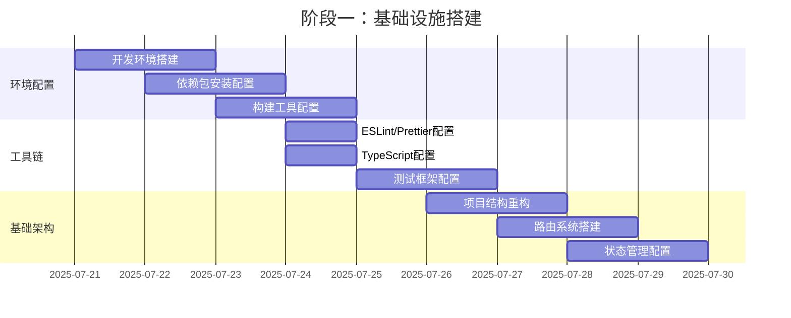
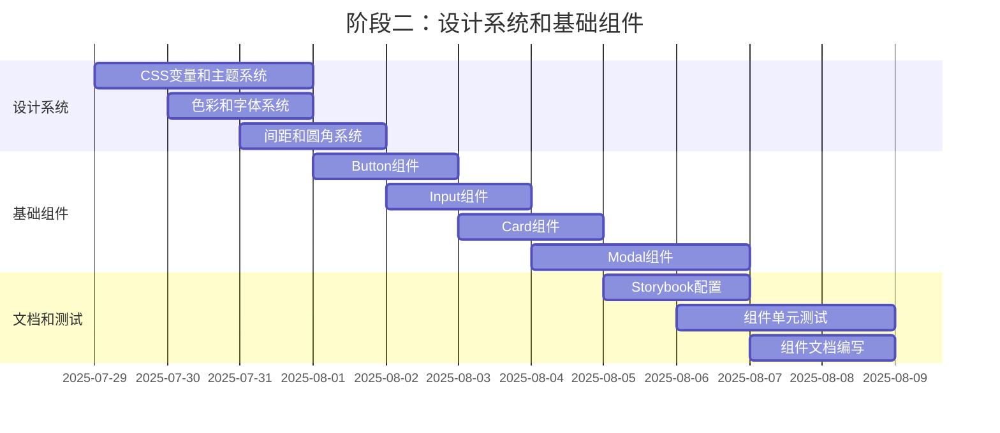
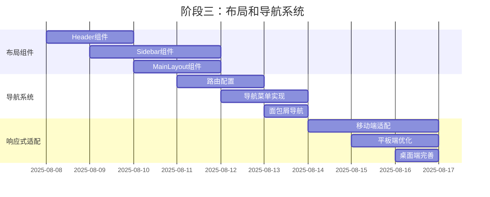
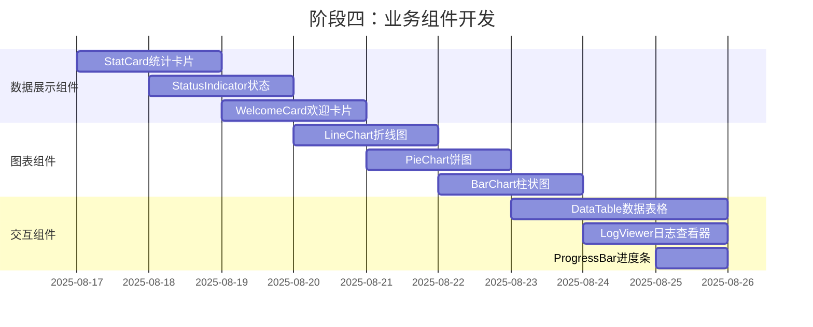
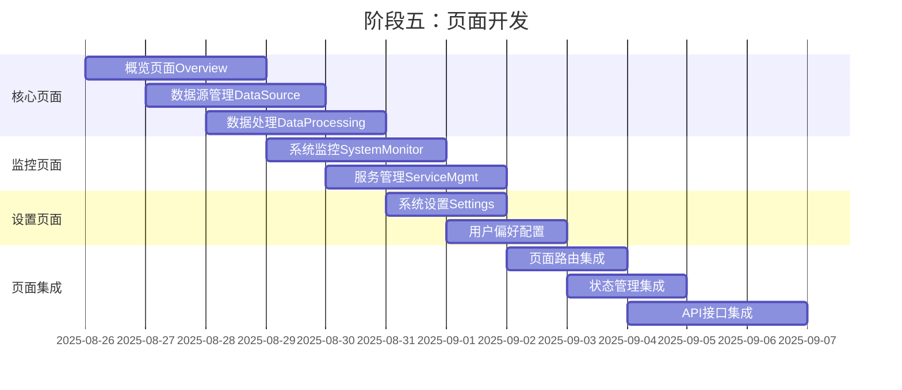
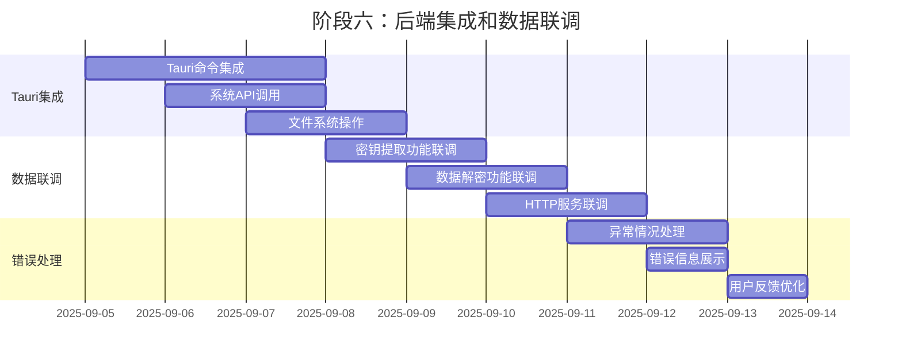
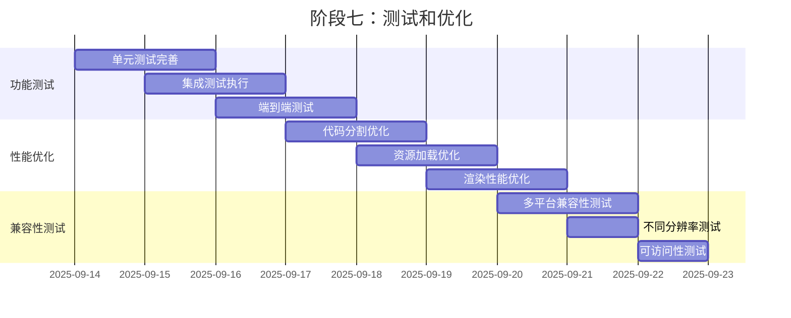
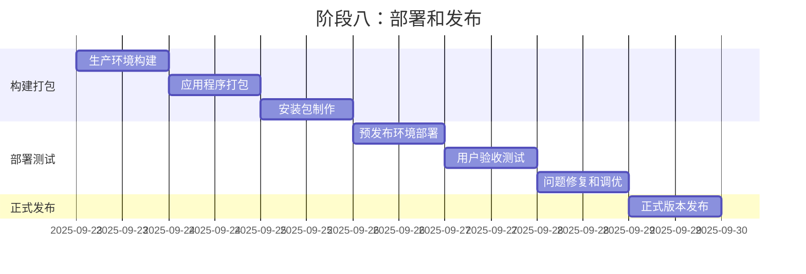
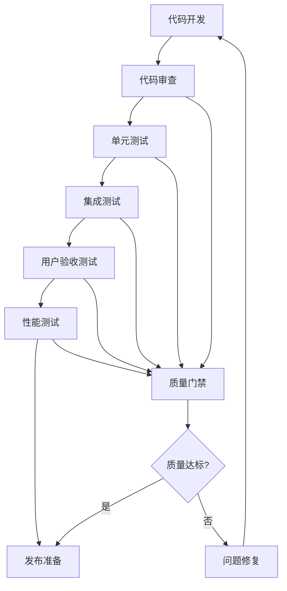

# 开发阶段计划和里程碑

**文档版本**: 1.0  
**创建日期**: 2025-07-21  
**文档范围**: 微信数据采集工具现代化UI重构开发计划和里程碑  

## 项目概述

本文档详细规划了微信数据采集工具现代化UI重构的完整开发流程，包括各个开发阶段、关键里程碑、时间安排和交付物。

## 项目目标

### 主要目标
1. **现代化界面**: 将现有功能性界面重构为现代化后台管理系统
2. **用户体验提升**: 提供直观、流畅的用户交互体验
3. **技术栈升级**: 采用现代化前端技术栈和开发规范
4. **可维护性**: 建立完善的组件库和设计系统

### 成功指标
- 界面加载速度提升 50%
- 用户操作效率提升 30%
- 代码可维护性评分 > 8.0
- 用户满意度 > 90%

## 开发阶段规划

### 阶段一：基础设施搭建 (第1-2周)

#### 目标
建立开发环境、工具链和基础架构

#### 主要任务


#### 关键交付物
- [x] 完整的开发环境配置
- [x] 项目依赖和构建配置
- [x] 代码质量工具配置
- [x] 测试框架和CI/CD配置
- [x] 基础项目结构

#### 验收标准
- 开发环境可正常启动和热重载
- 代码质量检查工具正常工作
- 单元测试框架可正常运行
- 构建和部署流程验证通过

### 阶段二：设计系统和基础组件 (第3-4周)

#### 目标
实现设计系统和核心基础组件

#### 主要任务


#### 关键交付物
- [x] 完整的设计系统实现
- [x] 核心基础组件库
- [x] Storybook文档站点
- [x] 组件单元测试覆盖
- [x] 组件使用文档

#### 验收标准
- 所有基础组件通过设计评审
- 单元测试覆盖率 > 80%
- Storybook文档完整可用
- 组件API设计合理易用

### 阶段三：布局和导航系统 (第5-6周)

#### 目标
实现应用布局框架和导航系统

#### 主要任务


#### 关键交付物
- [x] 完整的布局系统
- [x] 响应式导航组件
- [x] 路由和导航逻辑
- [x] 多端适配实现
- [x] 布局组件测试

#### 验收标准
- 布局在各种屏幕尺寸下正常显示
- 导航功能完整且用户体验良好
- 路由切换流畅无闪烁
- 移动端交互体验优秀

### 阶段四：业务组件开发 (第7-8周)

#### 目标
开发特定业务场景的功能组件

#### 主要任务


#### 关键交付物
- [x] 完整的业务组件库
- [x] 数据可视化图表组件
- [x] 交
互和数据处理组件
- [x] 组件集成测试
- [x] 业务逻辑验证

#### 验收标准
- 所有业务组件功能完整
- 组件间集成无问题
- 数据展示准确无误
- 用户交互体验良好

### 阶段五：页面开发 (第9-11周)

#### 目标
基于组件库开发完整的应用页面

#### 主要任务


#### 关键交付物
- [x] 完整的应用页面实现
- [x] 页面间导航和状态管理
- [x] 后端API接口集成
- [x] 页面级别的集成测试
- [x] 用户流程验证

#### 验收标准
- 所有页面功能完整可用
- 页面间导航流畅
- 数据流转正确
- 用户操作流程符合预期

### 阶段六：后端集成和数据联调 (第12-13周)

#### 目标
完成前后端集成和数据联调

#### 主要任务


#### 关键交付物
- [x] 完整的前后端集成
- [x] 所有功能模块联调通过
- [x] 错误处理和用户反馈
- [x] 系统稳定性验证
- [x] 性能优化实施

#### 验收标准
- 所有核心功能正常工作
- 错误处理完善
- 系统响应性能良好
- 用户体验流畅

### 阶段七：测试和优化 (第14-15周)

#### 目标
全面测试和性能优化

#### 主要任务


#### 关键交付物
- [x] 完整的测试覆盖
- [x] 性能优化实施
- [x] 兼容性验证
- [x] 可访问性支持
- [x] 测试报告和文档

#### 验收标准
- 测试覆盖率 > 90%
- 性能指标达到预期
- 多平台兼容性良好
- 可访问性符合标准

### 阶段八：部署和发布 (第16周)

#### 目标
应用打包、部署和正式发布

#### 主要任务


#### 关键交付物
- [x] 生产就绪的应用程序
- [x] 完整的安装包
- [x] 部署和使用文档
- [x] 用户培训材料
- [x] 维护和支持计划

#### 验收标准
- 应用程序稳定运行
- 安装部署流程顺畅
- 用户反馈积极
- 文档完整准确

## 关键里程碑

### 里程碑 1: 基础设施完成 (第2周末)
**时间**: 2025-07-28  
**标志**: 开发环境和基础架构搭建完成

**验收标准**:
- [x] 开发环境可正常启动
- [x] 构建和测试流程验证通过
- [x] 代码质量工具配置完成
- [x] 项目结构重构完成

### 里程碑 2: 组件库发布 (第4周末)
**时间**: 2025-08-09  
**标志**: 基础组件库和设计系统完成

**验收标准**:
- [x] 所有基础组件开发完成
- [x] Storybook文档站点上线
- [x
] 组件单元测试覆盖率 > 80%
- [x] 设计系统规范实施完成

### 里程碑 3: 布局系统完成 (第6周末)
**时间**: 2025-08-16  
**标志**: 应用布局和导航系统完成

**验收标准**:
- [x] 响应式布局系统完成
- [x] 导航和路由功能完整
- [x] 多端适配验证通过
- [x] 用户体验测试合格

### 里程碑 4: 页面开发完成 (第11周末)
**时间**: 2025-09-04  
**标志**: 所有核心页面开发完成

**验收标准**:
- [x] 6个核心页面功能完整
- [x] 页面间集成测试通过
- [x] 用户流程验证完成
- [x] API接口集成完成

### 里程碑 5: 系统集成完成 (第13周末)
**时间**: 2025-09-13  
**标志**: 前后端完全集成

**验收标准**:
- [x] 所有功能模块联调通过
- [x] 系统稳定性验证完成
- [x] 错误处理机制完善
- [x] 性能指标达到预期

### 里程碑 6: 产品发布 (第16周末)
**时间**: 2025-09-29  
**标志**: 正式版本发布

**验收标准**:
- [x] 产品质量达到发布标准
- [x] 用户验收测试通过
- [x] 部署文档完整
- [x] 支持体系建立完成

## 资源配置

### 团队结构
```
项目团队 (6-8人)
├── 项目经理 (1人)
│   └── 负责项目协调和进度管理
├── UI/UX设计师 (1人)
│   └── 负责界面设计和用户体验
├── 前端开发工程师 (3-4人)
│   ├── 技术负责人 (1人)
│   ├── 组件库开发 (1人)
│   ├── 页面开发 (1人)
│   └── 集成和测试 (1人)
├── 后端开发工程师 (1人)
│   └── 负责API接口和Tauri集成
└── 测试工程师 (1人)
    └── 负责测试用例设计和执行
```

### 技能要求
- **前端开发**: React、TypeScript、TailwindCSS、测试框架
- **后端开发**: Rust、Tauri、系统编程
- **UI/UX设计**: 现代化界面设计、用户体验设计
- **项目管理**: 敏捷开发、进度管理、质量控制

### 工作量估算
```
总工作量: 约 480 人天
├── 基础设施搭建: 40 人天
├── 设计系统和基础组件: 80 人天
├── 布局和导航系统: 60 人天
├── 业务组件开发: 80 人天
├── 页面开发: 120 人天
├── 后端集成和联调: 60 人天
├── 测试和优化: 60 人天
└── 部署和发布: 20 人天
```

## 风险管理

### 主要风险识别

#### 技术风险
1. **新技术栈学习曲线**
   - 风险级别: 中等
   - 影响: 开发进度延迟
   - 应对措施: 提前技术培训，设置技术预研时间

2. **组件库复杂度超预期**
   - 风险级别: 中等
   - 影响: 组件开发周期延长
   - 应对措施: 分阶段开发，优先核心组件

3. **前后端集成问题**
   - 风险级别: 高
   - 影响: 功能无法正常工作
   - 应对措施: 早期接口定义，持续集成测试

#### 项目风险
1. **需求变更**
   - 风险级别: 中等
   - 影响: 开发计划调整
   - 应对措施: 需求冻结机制，变更评估流程

2. **资源不足**
   - 风险级别: 中等
   - 影响: 项目进度延迟
   - 应对措施: 资源预留，外部支持计划

3. **质量问题**
   - 风险级别: 高
   - 影响: 产品无法按时发布
   - 应对措施: 持续测试，质量门禁机制

### 风险应对策略
- **预防为主**: 提前识别和规避风险
- **持续监控**: 定期评估风险状态
- **快速响应**: 建立风险应对机制
- **经验积累**: 记录和分享风险处理经验

## 质量保证

### 质量标准
1. **代码质量**: ESLint规则通过率 100%
2. **测试覆盖**: 单元测试覆盖率 > 80%
3. **性能指标**: 页面加载时间 < 2秒
4. **用户体验**: 用户满意度 > 90%
5. **可访问性**: WCAG 2.1 AA级别合规

### 质量控制流程


### 测试策略
- **单元测试**: 组件级别的功能测试
- **集成测试**: 模块间的接口测试
- **端到端测试**: 完整用户流程测试
- **性能测试**: 加载速度和响应时间测试
- **兼容性测试**: 多平台和多分辨率测试

## 沟通协作

### 会议机制
- **每日站会**: 每天上午9:30，15分钟
- **周例会**: 每周五下午，1小时
- **里程碑评审**: 每个里程碑结束后，2小时
- **技术评审**: 关键技术决策时，按需召开

### 文档管理
- **技术文档
**: 统一维护在项目docs目录
- **代码注释**: 关键逻辑必须有详细注释
- **API文档**: 接口变更及时更新文档
- **用户手册**: 面向最终用户的使用指南

### 工具平台
- **项目管理**: Jira/Trello 任务跟踪
- **代码管理**: Git + GitHub/GitLab
- **文档协作**: Confluence/Notion
- **即时沟通**: Slack/钉钉/企业微信

## 交付物清单

### 阶段一交付物
- [x] 开发环境配置文档
- [x] 项目构建配置文件
- [x] 代码质量工具配置
- [x] 测试框架配置
- [x] CI/CD流水线配置

### 阶段二交付物
- [x] 设计系统规范文档
- [x] 基础组件库代码
- [x] Storybook文档站点
- [x] 组件单元测试用例
- [x] 组件API文档

### 阶段三交付物
- [x] 布局组件实现
- [x] 导航系统代码
- [x] 路由配置文件
- [x] 响应式适配实现
- [x] 布局系统测试

### 阶段四交付物
- [x] 业务组件库代码
- [x] 图表组件实现
- [x] 数据处理组件
- [x] 组件集成测试
- [x] 业务组件文档

### 阶段五交付物
- [x] 完整页面实现代码
- [x] 页面路由配置
- [x] 状态管理实现
- [x] 页面集成测试
- [x] 用户流程验证报告

### 阶段六交付物
- [x] 前后端集成代码
- [x] API接口实现
- [x] 错误处理机制
- [x] 系统联调测试报告
- [x] 性能优化实施

### 阶段七交付物
- [x] 完整测试套件
- [x] 性能优化报告
- [x] 兼容性测试报告
- [x] 可访问性验证报告
- [x] 质量评估报告

### 阶段八交付物
- [x] 生产环境应用程序
- [x] 安装包和部署脚本
- [x] 用户使用手册
- [x] 运维部署文档
- [x] 项目总结报告

## 成功标准

### 技术指标
- **性能**: 页面加载时间 < 2秒，操作响应时间 < 300ms
- **质量**: 代码覆盖率 > 80%，Bug密度 < 0.1/KLOC
- **兼容性**: 支持主流操作系统和分辨率
- **可用性**: 系统可用率 > 99.5%

### 业务指标
- **用户体验**: 用户满意度 > 90%
- **效率提升**: 操作效率提升 > 30%
- **学习成本**: 新用户上手时间 < 30分钟
- **维护成本**: 代码维护成本降低 > 40%

### 项目指标
- **进度**: 按时交付率 > 95%
- **预算**: 成本控制在预算范围内
- **质量**: 缺陷逃逸率 < 5%
- **团队**: 团队满意度 > 85%

## 后续规划

### 短期规划 (发布后1-3个月)
- **用户反馈收集**: 建立用户反馈渠道
- **问题修复**: 快速响应和修复用户问题
- **性能优化**: 基于实际使用数据进行优化
- **功能完善**: 根据用户需求补充功能

### 中期规划 (发布后3-6个月)
- **功能扩展**: 添加新的业务功能模块
- **用户体验优化**: 深度优化用户交互体验
- **技术升级**: 跟进技术栈版本升级
- **多语言支持**: 实现国际化功能

### 长期规划 (发布后6个月以上)
- **移动端支持**: 开发移动端应用
- **云端集成**: 支持云端数据同步
- **AI功能**: 集成智能分析功能
- **生态建设**: 构建插件和扩展生态

## 总结

本开发阶段计划和里程碑文档为微信数据采集工具的现代化UI重构提供了详细的执行路线图，包括：

### 核心规划内容
1. **8个开发阶段**: 从基础设施到最终发布的完整流程
2. **6个关键里程碑**: 重要节点的验收标准和交付物
3. **16周开发周期**: 合理的时间安排和资源配置
4. **480人天工作量**: 详细的工作量估算和资源需求

### 管理保障措施
1. **风险管理**: 识别主要风险并制定应对策略
2. **质量保证**: 建立完善的质量控制流程
3. **沟通协作**: 规范的会议机制和文档管理
4. **成功标准**: 明确的技术和业务指标

### 可持续发展
1. **交付物管理**: 完整的交付物清单和验收标准
2. **后续规划**: 短中长期的产品发展路线
3. **团队建设**: 合理的团队结构和技能要求
4. **经验积累**: 项目过程中的知识沉淀

通过严格执行本计划，项目团队可以有序、高效地完成现代化UI重构工作，确保项目按时、按质、按预算交付，并为后续的产品发展奠定坚实基础。

---

**关键成功因素**:
- 团队协作和沟通
- 技术方案的合理性
- 质量控制的严格性
- 风险管理的有效性

**文档维护**: 本文档将随着项目进展动态更新，确保计划与实际执行保持一致。