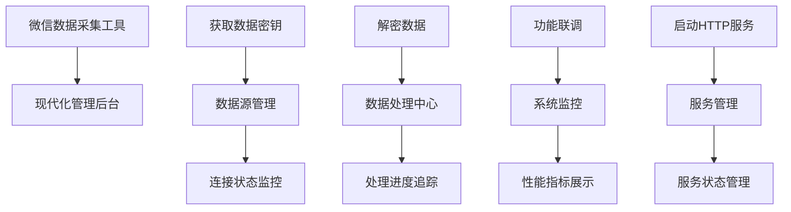

# 现代化UI架构设计文档

**文档版本**: 1.0  
**创建日期**: 2025-07-21  
**文档范围**: 微信数据采集工具现代化UI重构架构设计  

## 项目概述

基于现有的微信数据采集工具功能需求，参考现代化后台管理系统界面风格，将原有的功能性界面重构为具有现代化视觉设计和用户体验的管理后台系统。

## 功能需求分析

### 原有核心功能
1. **获取数据密钥** - 数据处理工作流起始步骤
2. **解密数据** - 核心数据处理功能
3. **功能联调** - 系统测试和调试
4. **启动HTTP服务** - 服务管理和部署

### 现代化功能映射


## 界面风格分析

### 参考界面特点
1. **整体布局**: 左侧导航 + 主内容区域的经典后台布局
2. **视觉风格**: 现代化扁平设计，白色背景，多色彩搭配
3. **数据展示**: 丰富的统计卡片、图表和数据可视化
4. **交互元素**: 悬停效果、状态反馈、流畅动画

### 设计风格定位
- **专业性**: B端产品的专业性和功能完整性
- **现代化**: 符合当前设计趋势的扁平化风格
- **数据驱动**: 突出数据展示和分析能力
- **用户友好**: 直观的操作流程和状态反馈

## UI架构设计

### 整体布局架构
```
┌─────────────────────────────────────────────────────────┐
│                    顶部导航栏                              │
│  [Logo] [用户信息] [系统状态] [设置] [通知] [用户头像]        │
├────────────┬────────────────────────────────────────────┤
│            │                                            │
│   左侧     │              主内容区域                      │
│   导航     │                                            │
│   菜单     │  ┌─────────────────────────────────────┐    │
│            │  │         欢迎/概览区域                │    │
│  • 概览    │  └─────────────────────────────────────┘    │
│  • 数据源  │                                            │
│  • 数据处理│  ┌─────┐ ┌─────┐ ┌─────┐ ┌─────┐          │
│  • 系统监控│  │统计1│ │统计2│ │统计3│ │统计4│          │
│  • 服务管理│  └─────┘ └─────┘ └─────┘ └─────┘          │
│  • 设置    │                                            │
│            │  ┌─────────────────────────────────────┐    │
│            │  │           图表/数据展示区域           │    │
│            │  └─────────────────────────────────────┘    │
└────────────┴────────────────────────────────────────────┘
```

### 导航结构设计
```
├── 📊 概览 (Overview)
│   ├── 系统状态总览
│   ├── 关键指标展示
│   └── 快速操作入口
│
├── 🔑 数据源管理 (Data Source)
│   ├── 密钥获取
│   ├── 连接状态监控
│   └── 数据源配置
│
├── ⚙️ 数据处理 (Data Processing)
│   ├── 数据解密
│   ├── 处理进度追踪
│   └── 处理历史记录
│
├── 📈 系统监控 (System Monitor)
│   ├── 性能指标
│   ├── 系统日志
│   └── 功能联调
│
├── 🌐 服务管理 (Service Management)
│   ├── HTTP服务控制
│   ├── 服务状态监控
│   └── 端口配置管理
│
└── ⚙️ 系统设置 (Settings)
    ├── 应用配置
    ├── 用户偏好
    └── 系统信息
```

## 组件架构设计

### 核心组件层次
```
App
├── Layout
│   ├── Header (顶部导航栏)
│   ├── Sidebar (左侧导航菜单)
│   └── MainContent (主内容区域)
│
├── Pages (页面组件)
│   ├── Overview (概览页面)
│   ├── DataSource (数据源管理)
│   ├── DataProcessing (数据处理)
│   ├── SystemMonitor (系统监控)
│   ├── ServiceManagement (服务管理)
│   └── Settings (系统设置)
│
├── Components (通用组件)
│   ├── StatCard (统计卡片)
│   ├── Chart (图表组件)
│   ├── StatusIndicator (状态指示器)
│   ├── ActionButton (操作按钮)
│   ├── DataTable (数据表格)
│   └── Modal (模态框)
│
└── Utils (工具函数)
    ├── api (API调用)
    ├── hooks (自定义Hook)
    └── constants (常量定义)
```

### 状态管理架构
```
Global State
├── System Status (系统状态)
│   ├── connection status
│   ├── service status
│   └── processing status
│
├── User Interface (界面状态)
│   ├── current page
│   ├── sidebar collapsed
│   └── theme settings
│
├── Data Management (数据管理)
│   ├── processing data
│   ├── statistics data
│   └── configuration data
│
└── Notifications (通知系统)
    ├── success messages
    ├── error messages
    └── warning alerts
```

## 技术栈选型

### 前端技术栈
- **框架**: React 18.3.1 (已有)
- **组件库**: React Aria Components 1.10.1 (已有)
- **样式框架**: TailwindCSS (CDN引入)
- **图标库**: FontAwesome (CDN引入)
- **状态管理**: React Context + useReducer
- **路由管理**: React Router v6
- **图表库**: Chart.js 或 Recharts
- **动画库**: Framer Motion
- **类型检查**: TypeScript 5.6.2 (已有)

### 桌面应用技术
- **桌面框架**: Tauri 2.0 (已有)
- **API通信**: @tauri-apps/api (已有)
- **系统集成**: @tauri-apps/plugin-opener (已有)

### 开发工具
- **构建工具**: Vite 6.0.3 (已有)
- **代码质量**: ESLint + Prettier
- **测试框架**: Vitest + React Testing Library

## 设计系统规范

### 色彩系统
```css
/* 主色调 */
--primary-50: #eff6ff;
--primary-500: #3b82f6;
--primary-600: #2563eb;
--primary-700: #1d4ed8;

/* 功能色彩 */
--success-500: #10b981;
--warning-500: #f59e0b;
--error-500: #ef4444;
--info-500: #06b6d4;

/* 中性色 */
--gray-50: #f9fafb;
--gray-100: #f3f4f6;
--gray-200: #e5e7eb;
--gray-500: #6b7280;
--gray-900: #111827;
```

### 字体系统
```css
/* 字体族 */
font-family: 'Inter', -apple-system, BlinkMacSystemFont, 'Segoe UI', sans-serif;

/* 字体大小 */
--text-xs: 0.75rem;    /* 12px */
--text-sm: 0.875rem;   /* 14px */
--text-base: 1rem;     /* 16px */
--text-lg: 1.125rem;   /* 18px */
--text-xl: 1.25rem;    /* 20px */
--text-2xl: 1.5rem;    /* 24px */
--text-3xl: 1.875rem;  /* 30px */
```

### 间距系统
```css
/* 间距单位 (基于 4px) */
--space-1: 0.25rem;    /* 4px */
--space-2: 0.5rem;     /* 8px */
--space-3: 0.75rem;    /* 12px */
--space-4: 1rem;       /* 16px */
--space-6: 1.5rem;     /* 24px */
--space-8: 2rem;       /* 32px */
--space-12: 3rem;      /* 48px */
--space-16: 4rem;      /* 64px */
```

### 圆角系统
```css
--radius-sm: 0.125rem;  /* 2px */
--radius-md: 0.375rem;  /* 6px */
--radius-lg: 0.5rem;    /* 8px */
--radius-xl: 0.75rem;   /* 12px */
--radius-2xl: 1rem;     /* 16px */
```

## 组件设计规范

### 统计卡片 (StatCard)
```typescript
interface StatCardProps {
  title: string;
  value: string | number;
  change?: {
    value: number;
    type: 'increase' | 'decrease';
    period: string;
  };
  icon?: React.ReactNode;
  color?: 'blue' | 'green' | 'orange' | 'purple';
  chart?: React.ReactNode;
}
```

### 状态指示器 (StatusIndicator)
```typescript
interface StatusIndicatorProps {
  status: 'success' | 'warning' | 'error' | 'info';
  text: string;
  size?: 'sm' | 'md' | 'lg';
  showIcon?: boolean;
}
```

### 操作按钮 (ActionButton)
```typescript
interface ActionButtonProps {
  variant: 'primary' | 'secondary' | 'danger' | 'ghost';
  size?: 'sm' | 'md' | 'lg';
  loading?: boolean;
  disabled?: boolean;
  icon?: React.ReactNode;
  children: React.ReactNode;
  onClick?: () => void;
}
```

## 页面设计规范

### 概览页面 (Overview)
**功能定位**: 系统状态总览和快速操作入口

**页面结构**:
```
┌─────────────────────────────────────────────────────────┐
│  欢迎卡片 (Welcome Card)                                  │
│  - 用户欢迎信息                                          │
│  - 系统状态概览                                          │
│  - 快速操作按钮                                          │
└─────────────────────────────────────────────────────────┘

┌─────┐ ┌─────┐ ┌─────┐ ┌─────┐
│统计1│ │统计2│ │统计3│ │统计4│
│活跃 │ │处理 │ │服务 │ │错误 │
│连接 │ │任务 │ │状态 │ │计数 │
└─────┘ └─────┘ └─────┘ └─────┘

┌─────────────────┐ ┌─────────────────┐
│   处理进度图表   │ │   系统性能监控   │
│                │ │                │
│   [折线图]      │ │   [仪表盘]      │
└─────────────────┘ └─────────────────┘
```

### 数据源管理页面 (DataSource)
**功能定位**: 数据密钥获取和连接状态管理

**核心功能**:
- 密钥获取操作
- 连接状态实时监控
- 数据源配置管理
- 连接历史记录

### 数据处理页面 (DataProcessing)
**功能定位**: 数据解密和处理进度追踪

**核心功能**:
- 数据解密操作
- 处理进度实时显示
- 处理结果展示
- 处理历史管理

### 系统监控页面 (SystemMonitor)
**功能定位**: 系统性能监控和功能调试

**核心功能**:
- 系统性能指标
- 实时日志展示
- 功能联调工具
- 错误诊断

### 服务管理页面 (ServiceManagement)
**功能定位**: HTTP服务控制和状态监控

**核心功能**:
- 服务启停控制
- 端口配置管理
- 服务状态监控
- API接口文档

## 响应式设计策略

### 断点系统
```css
/* 移动设备 */
@media (max-width: 640px) { /* sm */ }

/* 平板设备 */
@media (min-width: 641px
) and (max-width: 1024px) { /* md */ }

/* 桌面设备 */
@media (min-width: 1025px) { /* lg */ }

/* 大屏设备 */
@media (min-width: 1280px) { /* xl */ }
```

### 适配策略
- **移动端**: 单栏布局，隐藏侧边栏，使用底部导航
- **平板端**: 可折叠侧边栏，优化触摸交互
- **桌面端**: 完整布局，丰富的交互效果

## 性能优化策略

### 代码分割
```typescript
// 路由级别的代码分割
const Overview = lazy(() => import('./pages/Overview'));
const DataSource = lazy(() => import('./pages/DataSource'));
const DataProcessing = lazy(() => import('./pages/DataProcessing'));
```

### 状态优化
- 使用React.memo优化组件渲染
- 实现虚拟滚动处理大量数据
- 使用防抖和节流优化用户交互

### 资源优化
- 图标使用SVG格式，支持主题切换
- 图片使用WebP格式，提供fallback
- 字体使用系统字体栈，减少加载时间

## 可访问性设计

### 键盘导航
- 所有交互元素支持Tab键导航
- 提供跳转到主内容的快捷键
- 模态框支持Escape键关闭

### 屏幕阅读器支持
- 使用语义化HTML标签
- 提供适当的ARIA标签
- 图片提供alt文本描述

### 色彩对比度
- 确保文字和背景对比度符合WCAG 2.1 AA标准
- 不仅依赖颜色传达信息
- 提供高对比度主题选项

## 国际化支持

### 多语言架构
```typescript
// 语言配置
const languages = {
  'zh-CN': '简体中文',
  'zh-TW': '繁體中文',
  'en-US': 'English'
};

// 翻译文件结构
src/
├── locales/
│   ├── zh-CN/
│   │   ├── common.json
│   │   ├── pages.json
│   │   └── components.json
│   ├── zh-TW/
│   └── en-US/
```

### 本地化考虑
- 文字方向支持（LTR/RTL）
- 日期时间格式本地化
- 数字格式本地化
- 货币格式本地化

## 主题系统设计

### 主题切换架构
```typescript
interface Theme {
  name: string;
  colors: {
    primary: string;
    secondary: string;
    background: string;
    surface: string;
    text: string;
  };
  spacing: SpacingSystem;
  typography: TypographySystem;
}

const themes: Record<string, Theme> = {
  light: lightTheme,
  dark: darkTheme,
  highContrast: highContrastTheme
};
```

### 主题实现策略
- 使用CSS变量实现主题切换
- 支持系统主题自动切换
- 用户偏好持久化存储

## 开发规范

### 文件组织结构
```
src/
├── components/          # 通用组件
│   ├── ui/             # 基础UI组件
│   ├── layout/         # 布局组件
│   └── charts/         # 图表组件
├── pages/              # 页面组件
├── hooks/              # 自定义Hook
├── utils/              # 工具函数
├── types/              # TypeScript类型定义
├── constants/          # 常量定义
├── styles/             # 全局样式
└── locales/            # 国际化文件
```

### 命名规范
- **组件**: PascalCase (例: `StatCard`)
- **文件**: kebab-case (例: `stat-card.tsx`)
- **变量**: camelCase (例: `isLoading`)
- **常量**: UPPER_SNAKE_CASE (例: `API_BASE_URL`)

### 代码质量标准
- TypeScript严格模式
- ESLint + Prettier代码格式化
- 组件必须有PropTypes或TypeScript接口
- 单元测试覆盖率 > 80%

## 测试策略

### 测试层次
1. **单元测试**: 组件逻辑测试
2. **集成测试**: 组件交互测试
3. **端到端测试**: 用户流程测试

### 测试工具
- **单元测试**: Vitest + React Testing Library
- **端到端测试**: Playwright
- **视觉回归测试**: Chromatic

## 部署和构建

### 构建优化
```typescript
// vite.config.ts
export default defineConfig({
  build: {
    rollupOptions: {
      output: {
        manualChunks: {
          vendor: ['react', 'react-dom'],
          charts: ['chart.js', 'recharts'],
          ui: ['react-aria-components']
        }
      }
    }
  }
});
```

### 环境配置
- **开发环境**: 热重载，详细错误信息
- **测试环境**: 模拟数据，测试覆盖率
- **生产环境**: 代码压缩，性能监控

## 监控和分析

### 性能监控
- 页面加载时间监控
- 组件渲染性能分析
- 内存使用情况监控

### 用户行为分析
- 功能使用频率统计
- 用户操作路径分析
- 错误发生率监控

## 总结

本架构设计文档为微信数据采集工具的现代化UI重构提供了全面的技术指导。通过采用现代化的技术栈、完善的设计系统和严格的开发规范，确保最终产品具有优秀的用户体验、良好的可维护性和扩展性。

下一步将基于此架构设计创建详细的技术实施方案和开发计划。

---

**文档维护**: 本文档将随着项目进展持续更新和完善。