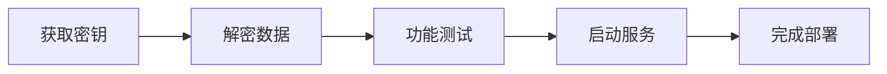

# UI设计规范文档

**文档版本**: 1.0  
**创建日期**: 2025-07-21  
**文档范围**: 微信数据采集工具界面设计规范  

## 概述

本文档详细描述了微信数据采集和管理工具的用户界面设计规范，包括页面布局、功能模块、交互元素和信息架构等核心设计要素。

## 整体布局架构

### 布局结构
- **布局类型**: 三栏式响应式布局
- **主要区域**:
  - 左侧导航栏: 固定宽度侧边栏
  - 中上功能区: 主要操作功能区域
  - 中下信息区: 状态展示和日志区域

### 布局特点
- 采用经典的Dashboard布局模式
- 信息层次清晰，功能分区明确
- 支持不同屏幕尺寸的适配

## 左侧导航栏设计

### 导航结构
```
├── 首页 (🏠)
│   └── 主入口和概览页面
└── 数据分析 (📊)
    └── 数据处理和分析功能
```

### 导航特性
- **视觉设计**: 图标 + 文字组合
- **交互方式**: 垂直导航结构
- **状态反馈**: 当前页面高亮显示
- **扩展性**: 支持添加更多功能模块

## 顶部状态栏

### 系统信息展示
| 信息类型 | 显示内容 | 示例值 |
|---------|---------|--------|
| 账号信息 | 当前用户标识 | wxid_acqailn |
| 平台信息 | 操作系统类型 | Windows |
| 进程信息 | 进程ID | PID: 344036 |
| 版本信息 | 应用版本号 | 4.0.3.36 |

### 设计原则
- 提供关键系统上下文信息
- 信息密度适中，避免过载
- 支持快速状态识别

## 主要功能区域

### 功能模块布局
采用 **2x2 网格布局**，四个核心功能模块：

#### 1. 获取数据密钥
- **功能定位**: 主要数据获取功能
- **操作类型**: 关键操作入口
- **用户流程**: 数据处理工作流的起始步骤

#### 2. 解密数据
- **功能定位**: 数据处理核心功能
- **操作类型**: 数据转换处理
- **用户流程**: 与密钥获取形成完整工作流

#### 3. 功能联调
- **功能定位**: 系统测试和调试功能
- **操作类型**: 开发者工具特性
- **用户流程**: 验证和测试环节

#### 4. 启动HTTP服务
- **功能定位**: 服务管理功能
- **操作类型**: 服务启停控制
- **界面元素**: 右上角配置按钮
- **用户流程**: 服务化部署支持

### 功能模块设计规范
- **视觉层次**: 统一的卡片式设计
- **交互反馈**: 点击状态和加载状态
- **信息密度**: 简洁明了的功能描述
- **操作引导**: 清晰的操作流程指示

## 信息展示区域

### 状态指示系统

#### 状态颜色编码
| 颜色 | 状态类型 | 含义 | 使用场景 |
|------|---------|------|----------|
| 🟢 绿色 | 成功状态 | 操作成功完成 | 密钥获取成功、服务启动成功 |
| 🔵 蓝色 | 信息状态 | 进行中或信息提示 | HTTP服务运行、数据库连接 |
| 🟡 黄色 | 警告状态 | 需要注意的状态 | 配置警告、性能提示 |

#### 状态信息层次
1. **系统状态层**
   - 数据密钥获取状态
   - HTTP服务启动状态（端口8080）
   - 网页访问状态提示

2. **数据库连接层**
   - 数据库文件路径显示
   - 连接状态实时反馈
   - 数据源标识（data.sqlite）

3. **操作反馈层**
   - 退出程序状态
   - 错误信息提示
   - 操作结果确认

### 信息展示原则
- **实时性**: 状态信息实时更新
- **可读性**: 清晰的文字说明
- **层次性**: 重要信息优先显示
- **一致性**: 统一的信息格式

## 用户体验设计

### 操作流程设计


#### 渐进式操作流程
1. **获取密钥** → 获取数据处理所需的密钥
2. **解密数据** → 使用密钥解密目标数据
3. **功能测试** → 验证数据处理结果
4. **服务启动** → 启动HTTP服务提供接口

### 反馈机制设计
- **即时反馈**: 操作结果立即显示
- **状态持久**: 重要状态信息持续显示
- **错误处理**: 清晰的错误信息和解决建议

### 信息架构
```
顶层: 系统上下文信息
├── 用户身份信息
├── 系统环境信息
└── 应用版本信息

中层: 核心功能操作
├── 数据获取模块
├── 数据处理模块
├── 测试调试模块
└── 服务管理模块

底层: 状态反馈信息
├── 操作结果反馈
├── 系统状态监控
└── 错误信息提示
```

## 设计亮点总结

### 专业工具软件特征
1. **功能导向**: 界面设计围绕核心功能展开
2. **状态透明**: 所有重要状态信息可视化
3. **操作流程清晰**: 符合用户工作流程的界面组织

### 开发者友好特性
1. **调试支持**: 提供功能联调和测试工具
2. **状态监控**: 详细的系统状态和运行信息
3. **服务化设计**: 支持HTTP服务模式便于集成
4. **实时反馈**: 操作结果和错误信息即时显示

### 技术用户体验优化
1. **专业术语**: 使用准确的技术术语和标识
2. **详细日志**: 提供完整的操作日志和状态信息
3. **灵活配置**: 支持服务端口等参数配置
4. **批量操作**: 支持数据批量处理和管理

## 界面元素规范

### 按钮设计规范
- **主要操作按钮**: 突出显示，使用品牌色
- **次要操作按钮**: 中性色调，清晰可识别
- **危险操作按钮**: 警告色调，防止误操作
- **配置按钮**: 通常位于功能模块右上角

### 状态指示器规范
- **圆点指示器**: 用于快速状态识别
- **文字说明**: 配合图标提供详细信息
- **颜色一致性**: 全局统一的颜色语义

### 信息展示规范
- **层次结构**: 使用缩进和分组组织信息
- **关键信息**: 使用加粗或颜色突出显示
- **辅助信息**: 使用较小字体或淡化处理

## 响应式设计考虑

### 屏幕适配
- **大屏幕**: 充分利用空间，展示更多信息
- **中等屏幕**: 保持核心功能可用性
- **小屏幕**: 优先显示最重要的功能和信息

### 交互适配
- **鼠标交互**: 支持悬停状态和右键菜单
- **键盘导航**: 支持Tab键导航和快捷键
- **触摸交互**: 考虑触摸屏设备的使用场景

## 可访问性设计

### 视觉可访问性
- **对比度**: 确保文字和背景有足够对比度
- **字体大小**: 使用合适的字体大小确保可读性
- **颜色依赖**: 不仅依赖颜色传达信息

### 操作可访问性
- **键盘导航**: 所有功能支持键盘操作
- **屏幕阅读器**: 提供适当的标签和描述
- **操作反馈**: 提供清晰的操作结果反馈

## 性能优化考虑

### 界面性能
- **渲染优化**: 避免不必要的重绘和回流
- **数据更新**: 使用增量更新减少界面闪烁
- **资源加载**: 优化图标和样式资源加载

### 用户体验性能
- **响应速度**: 操作响应时间控制在合理范围
- **加载状态**: 提供加载指示器和进度反馈
- **错误恢复**: 提供错误恢复和重试机制

## 扩展性设计

### 功能扩展
- **模块化设计**: 支持新功能模块的添加
- **插件架构**: 考虑第三方功能集成
- **配置灵活性**: 支持用户自定义配置选项

### 界面扩展
- **主题支持**: 支持多种视觉主题切换
- **布局调整**: 支持用户自定义布局偏好
- **国际化**: 支持多语言界面显示

## 维护和更新指南

### 设计一致性维护
- **设计系统**: 建立完整的设计系统文档
- **组件库**: 维护可复用的UI组件库
- **设计评审**: 建立设计变更评审流程

### 用户反馈整合
- **用户测试**: 定期进行用户体验测试
- **反馈收集**: 建立用户反馈收集机制
- **迭代优化**: 基于用户反馈持续优化界面

## 技术实现建议

### 前端技术栈
- **框架选择**: 建议使用现代前端框架（React/Vue/Angular）
- **状态管理**: 使用适当的状态管理方案
- **样式方案**: 采用模块化CSS或CSS-in-JS方案

### 开发规范
- **代码组织**: 按功能模块组织代码结构
- **样式规范**: 建立统一的样式编写规范
- **测试覆盖**: 确保UI组件有充分的测试覆盖

## 总结

本UI设计规范文档全面描述了微信数据采集工具的界面设计要求和实现指南。设计以用户体验为中心，兼顾功能性、可用性和可维护性，为开发团队提供了清晰的设计方向和实现指导。

在后续的开发过程中，应严格遵循本规范，同时根据实际需求和用户反馈进行适当调整和优化，确保最终产品能够满足用户需求并提供优秀的使用体验。

---

**文档维护**: 本文档应随着产品迭代持续更新，确保设计规范与实际产品保持一致。